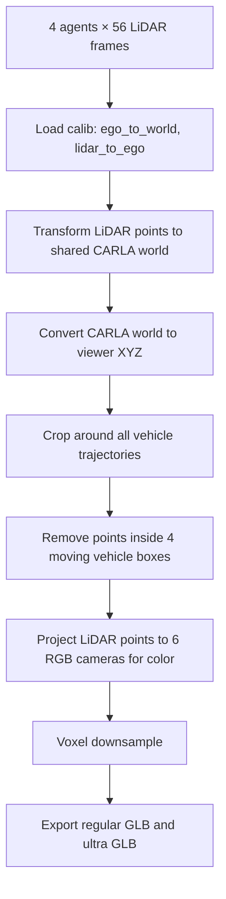
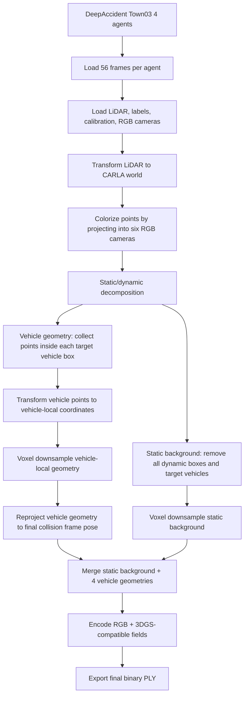
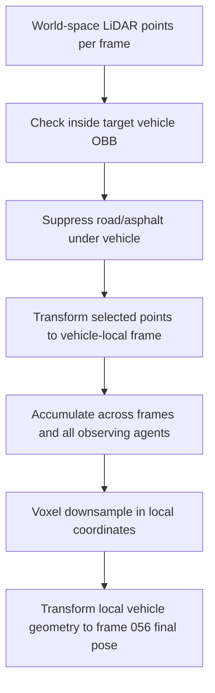

# DeepAccident 4대 차량 사고 재구성 연구 정리

작성일: 2026-04-27  
작성 범위: **성공 산출물 2개만 정리**  
대상 산출물:

1. **4대 차량 사고 과정 재현 웹뷰어**  
   `/home/elicer/workspace/deepaccident_four_vehicle_collision_town03/viewer/index.html`
2. **최종 clean hybrid Gaussian/RGB PLY 3D reconstruction 결과**  
   `/home/elicer/workspace/deepaccident_town03_4dashcam_3dgs_final/town03_4dashcam_collision_3dgs_45000.ply`

본 문서는 논문 작성을 위한 연구 방법, 데이터셋, 시나리오, 구현 workflow, 산출물 구조, 정량 검증 결과, 재현 명령, 논문화 포인트를 성공 산출물 중심으로 정리한다.

---

## 1. 연구의 핵심 목적

본 연구의 목적은 다중 차량 사고 장면을 단일 시점 dashcam 영상만으로 단순 재생하는 것이 아니라, **사고에 관여한 4대 차량의 다중 센서 기록을 하나의 공유 3D 공간으로 정렬하고, 정적 도로 환경과 동적 차량을 분리해 사고 직전부터 충돌 시점까지의 움직임을 3차원으로 재구성하는 것**이다.

연구에서 달성한 성공 결과는 두 가지이다.

| 산출물 | 목적 | 핵심 기술 |
|---|---|---|
| 4대 차량 사고 과정 웹뷰어 | 사람이 사고 과정을 시간 순서대로 이해할 수 있는 interactive replay | DeepAccident calibration 기반 차량 pose 추적, 4-agent LiDAR static background fusion, dynamic vehicle box 제거, Three.js temporal visualization |
| clean hybrid Gaussian/RGB PLY | 사고 시점의 도로 환경과 실제 관측 차량 형상을 하나의 고밀도 3D 파일로 제공 | LiDAR-camera RGB fusion, dynamic/static decomposition, vehicle-local motion compensation, Gaussian-compatible PLY encoding |

핵심 아이디어는 다음과 같다.

1. **정적 배경과 동적 차량을 분리한다.**  
   사고 장면에서는 차량이 움직이기 때문에, 모든 프레임을 하나의 정적 장면으로 합치면 차량 잔상과 ghosting이 생긴다. 따라서 도로/건물/가로시설 등 정적 요소는 fused static background로 만들고, 차량은 별도 객체 trajectory 또는 motion-compensated geometry로 처리한다.

2. **4대 차량의 calibration pose를 공통 metric world에 정렬한다.**  
   각 차량은 ego 기준 센서 좌표계를 가지지만, DeepAccident calibration의 `ego_to_world`, `lidar_to_ego`, `lidar_to_camera`, camera intrinsic을 이용해 모든 센서 관측을 공통 world coordinate로 변환한다.

3. **충돌 시점의 차량 geometry는 vehicle-local 좌표로 누적한 뒤 최종 사고 pose로 재배치한다.**  
   각 프레임에서 차량 box 내부에 들어오는 실제 관측 LiDAR point를 차량 local 좌표로 변환해 누적하고, 최종 충돌 프레임의 차량 pose로 다시 world coordinate에 배치한다. 이렇게 하면 움직이는 차량을 정적 배경에 ghosting 없이 표현할 수 있다.

4. **출력 PLY는 일반 RGB point cloud viewer와 3D Gaussian Splatting viewer 모두에서 읽을 수 있게 구성한다.**  
   최종 PLY에는 `red/green/blue` 필드뿐 아니라 3DGS 계열 viewer가 사용하는 `f_dc`, `f_rest`, `opacity`, `scale`, `rot` 필드도 포함했다.

---

## 2. 외부 기술 및 데이터셋 배경

### 2.1 DeepAccident 데이터셋

본 연구는 DeepAccident 데이터셋의 mini/local copy를 사용했다.

- 로컬 데이터셋 경로: `/home/elicer/deepaccident_mini_dataset`
- 사용 category: `type1_subtype1_accident`
- 사용 scenario: `Town03_type001_subtype0001_scenario00024`

DeepAccident 공식 데이터 설명에 따르면, DeepAccident는 실제 교통에서 자주 발생하는 사고 유형을 바탕으로 CARLA 환경에서 설계된 사고 시나리오를 제공하며, 각 scenario에는 **충돌 차량 2대와 후속 차량 2대**가 포함된다. 또한 다중 RGB camera와 LiDAR를 포함한 센서 데이터를 제공한다. 공식 설명에서는 차량 RGB camera 해상도가 **1600×900**이고, LiDAR는 차량 상단에 장착된 32채널 센서로 설명된다. 데이터는 CARLA의 여러 town에서 수집되며, 본 연구는 그중 Town03 장면을 사용했다.

참고 자료:

- DeepAccident 공식 데이터 페이지: https://deepaccident.github.io/data.html
- DeepAccident citation: Wang et al., *DeepAccident: A Motion and Accident Prediction Benchmark for V2X Autonomous Driving*, arXiv:2304.01168, 2023.

### 2.2 3D Gaussian Splatting 계열 표현

3D Gaussian Splatting은 장면을 point나 mesh가 아니라 3D Gaussian primitive의 집합으로 표현하고, 각 Gaussian의 위치, 색상, opacity, scale, rotation 등을 사용해 빠르게 rendering하는 방식이다. 원 논문은 sparse point와 camera calibration에서 시작해 3D Gaussian을 최적화하고, real-time rendering을 목표로 한다.

본 연구의 최종 PLY는 순수 vanilla 3DGS 학습 산출물이라기보다, **LiDAR-camera fusion으로 얻은 실제 geometry를 Gaussian-compatible field layout으로 저장한 hybrid representation**이다. 즉, 사고 분석에서 중요한 metric geometry와 차량 위치 안정성을 우선하면서도, 3DGS viewer 계열과 호환되는 속성을 포함한다.

참고 자료:

- Kerbl et al., *3D Gaussian Splatting for Real-Time Radiance Field Rendering*, ACM TOG 42(4), 2023. arXiv:2308.04079. https://arxiv.org/abs/2308.04079

---

## 3. 사용 데이터의 정확한 구성

### 3.1 선택된 사고 scenario

| 항목 | 값 |
|---|---|
| 데이터셋 root | `/home/elicer/deepaccident_mini_dataset` |
| Category | `type1_subtype1_accident` |
| Scenario | `Town03_type001_subtype0001_scenario00024` |
| Weather | `MidRainSunset` |
| Road type | `four-way junction` |
| Metadata colliding agents | `ego`, `other` |
| Agent ID order | `2675`, `2690`, `2671`, `2691` |
| 사용 frame 범위 | source frame `001`–`056` |
| Web viewer accident index | `55`, 즉 source frame `056` |
| Metadata accident frame | `66` |
| 실제 사용 가능한 mini subset frame 수 | 56 |
| 충돌 판정 | source frame `054`, `055`, `056`에서 ego/other OBB overlap |
| 최종 overlap frame | source frame `056` |
| 최종 OBB gap | `-0.447944 m` |
| 최종 center distance | `4.229926 m` |

주의: metadata에는 accident frame이 66으로 기록되어 있지만, 현재 로컬 mini subset은 각 agent/sensor별 56 frame을 포함한다. 따라서 본 연구 산출물은 사용 가능한 frame 001–056 중, OBB overlap이 확인되는 마지막 frame 056을 사고 재현의 최종 충돌 시점으로 사용한다.

### 3.2 참여 차량 4대

DeepAccident의 4-agent 구조를 그대로 사용했다.

| 내부 agent | 논문/뷰어 명칭 | 역할 | Vehicle type | 길이 m | 폭 m | 높이 m |
|---|---|---|---|---:|---:|---:|
| `ego_vehicle` | Collision vehicle A | 충돌 차량 A | car | 4.9742 | 2.0384 | 1.5421 |
| `ego_vehicle_behind` | Follower behind A | 충돌 차량 A의 후속 차량 | car | 4.5135 | 2.0068 | 1.5248 |
| `other_vehicle` | Collision vehicle B | 충돌 차량 B | car | 4.8557 | 2.0328 | 1.6494 |
| `other_vehicle_behind` | Follower behind B | 충돌 차량 B의 후속 차량 | car | 4.9017 | 2.1283 | 1.5107 |

### 3.3 각 agent별 센서 데이터

각 4개 agent 모두 동일한 frame 수와 sensor 구성을 가진다.

| Sensor / annotation | 각 agent별 파일 수 | 설명 |
|---|---:|---|
| `Camera_Front` | 56 | 전방 RGB dashcam |
| `Camera_FrontLeft` | 56 | 전좌측 RGB camera |
| `Camera_FrontRight` | 56 | 전우측 RGB camera |
| `Camera_BackLeft` | 56 | 후좌측 RGB camera |
| `Camera_BackRight` | 56 | 후우측 RGB camera |
| `Camera_Back` | 56 | 후방 RGB camera |
| `lidar01` | 56 | LiDAR point cloud, `.npz`, shape 예: `(41325, 4)` |
| `calib` | 56 | calibration `.pkl` |
| `label` | 56 | 3D object label `.txt` |
| `BEV_instance_camera` | 56 | BEV instance camera image |

RGB camera sample:

- 해상도: `1600 × 900`
- color mode: RGB

LiDAR sample:

- 예시 파일: `ego_vehicle/lidar01/Town03_type001_subtype0001_scenario00024_001.npz`
- shape: `(41325, 4)`
- 네 번째 channel은 intensity 또는 LiDAR return strength로 사용했다.

Calibration file에는 다음 key들이 포함된다.

- `ego_to_world`
- `lidar_to_ego`
- `lidar_to_Camera_Front`
- `lidar_to_Camera_FrontLeft`
- `lidar_to_Camera_FrontRight`
- `lidar_to_Camera_BackLeft`
- `lidar_to_Camera_BackRight`
- `lidar_to_Camera_Back`
- `intrinsic_Camera_Front`
- `intrinsic_Camera_FrontLeft`
- `intrinsic_Camera_FrontRight`
- `intrinsic_Camera_BackLeft`
- `intrinsic_Camera_BackRight`
- `intrinsic_Camera_Back`

---

## 4. 성공 산출물 1: 4대 차량 사고 과정 재현 웹뷰어

### 4.1 산출물 경로

| 항목 | 경로 |
|---|---|
| Viewer root | `/home/elicer/workspace/deepaccident_four_vehicle_collision_town03` |
| HTML viewer | `/home/elicer/workspace/deepaccident_four_vehicle_collision_town03/viewer/index.html` |
| Scene data JS | `/home/elicer/workspace/deepaccident_four_vehicle_collision_town03/viewer/four_vehicle_scene_data.js` |
| Regular static background GLB | `/home/elicer/workspace/deepaccident_four_vehicle_collision_town03/viewer_assets/four_vehicle_static_lidar_background.glb` |
| Ultra static background GLB | `/home/elicer/workspace/deepaccident_four_vehicle_collision_town03/viewer_assets/four_vehicle_static_lidar_background_ultra.glb` |
| Dashcam display frames | `/home/elicer/workspace/deepaccident_four_vehicle_collision_town03/viewer_frames/<agent>/frame_XXXX.jpg` |
| Top-down preview | `/home/elicer/workspace/deepaccident_four_vehicle_collision_town03/previews/four_vehicle_topdown_plan.png` |
| Build script | `/home/elicer/workspace/deepaccident_four_vehicle_collision_town03/scripts/build_four_vehicle_collision_viewer.py` |

### 4.2 사고 과정 재현의 목표

웹뷰어의 목표는 다음이다.

1. 4대 차량을 모두 보여준다.
2. 충돌 당사자인 `ego_vehicle`과 `other_vehicle`이 실제로 서로 접근해 overlap되는 과정을 보여준다.
3. 각 충돌 차량을 뒤따르는 follower 차량 2대도 동시에 보여준다.
4. 정적 도로/교차로/주변 환경은 하나의 fused 3D background로 유지한다.
5. 차량은 calibration 기반 frame-wise pose로 움직인다.
6. 각 frame에 대응하는 4대 차량의 front dashcam 영상을 동시에 보여준다.

### 4.3 Coordinate system 및 metric alignment

웹뷰어는 CARLA world 좌표계를 Three.js viewer에 맞게 변환한다.

| 좌표 | 의미 |
|---|---|
| Viewer X | CARLA X |
| Viewer Y | CARLA Z, 즉 up direction |
| Viewer Z | CARLA Y |

공유 origin은 4대 차량의 front camera world trajectory를 모두 모은 뒤, X/Z 방향 중심과 평균 높이를 사용해 계산했다.

| 항목 | 값 |
|---|---:|
| `origin_viewer_xyz[0]` | `82.924065` |
| `origin_viewer_xyz[1]` | `8.274038` |
| `origin_viewer_xyz[2]` | `-127.440470` |
| `ground_y` | `-0.285255` |

이 공통 origin을 사용함으로써 4개 agent의 pose가 하나의 metric scene 안에 배치된다.

### 4.4 차량 trajectory reconstruction

각 차량의 pose는 DeepAccident calibration의 `ego_to_world`에서 얻는다. 각 frame의 `ego_to_world` 행렬은 다음 변환을 거쳐 viewer matrix로 저장된다.

1. `ego_to_world`에서 rotation과 translation 추출
2. translation을 CARLA 좌표에서 viewer 좌표로 변환
3. 공유 origin을 빼서 viewer-local metric 좌표로 정렬
4. rotation column을 viewer coordinate convention에 맞게 재배열
5. 4×4 homogeneous transformation matrix로 저장

수식 형태로 쓰면 다음과 같다.

```text
p_viewer = carla_to_viewer(t_ego_to_world) - origin
R_viewer[:,0] = carla_to_viewer(R_carla[:,0])  # local forward
R_viewer[:,1] = carla_to_viewer(R_carla[:,2])  # local up
R_viewer[:,2] = carla_to_viewer(R_carla[:,1])  # local right
T_viewer = [[R_viewer, p_viewer], [0,0,0,1]]
```

각 frame에는 다음 값이 저장된다.

- `source_frame`
- `vehicle_position`
- `vehicle_matrix`
- `step_motion`
- `cumulative_motion`

### 4.5 차량별 움직임 요약

| 차량 | source frames | 시작 위치 viewer XYZ | 최종 위치 viewer XYZ | net displacement m | cumulative motion m |
|---|---:|---|---|---:|---:|
| Collision vehicle A / `ego_vehicle` | 001–056 | `[-39.9276, -4.9491, -6.4091]` | `[-2.3689, -0.2217, 6.2037]` | 39.9009 | 45.3999 |
| Follower behind A / `ego_vehicle_behind` | 001–056 | `[-57.2733, -7.7009, -6.7813]` | `[-25.1699, -1.7445, -6.0938]` | 32.6585 | 32.6815 |
| Collision vehicle B / `other_vehicle` | 001–056 | `[42.0792, -0.2855, -8.1538]` | `[-0.5339, -0.2462, 2.3926]` | 43.8988 | 48.1233 |
| Follower behind B / `other_vehicle_behind` | 001–056 | `[57.6313, -0.2416, -7.8203]` | `[16.3492, -0.2397, -8.7018]` | 41.2916 | 41.2917 |

### 4.6 충돌 판정

충돌 판정은 `ego_vehicle`과 `other_vehicle`의 oriented bounding box를 사용해 계산했다. 두 차량 box를 2D ground plane에 투영하고 Separating Axis Theorem 기반으로 gap을 계산했다.

| 항목 | 값 |
|---|---:|
| 충돌 pair | Collision vehicle A ↔ Collision vehicle B |
| overlap source frames | `054`, `055`, `056` |
| closest/overlap source frame | `056` |
| OBB gap | `-0.447944 m` |
| center distance | `4.229926 m` |

OBB gap이 음수라는 것은 두 차량의 bounding box가 shared metric world에서 겹친다는 뜻이다. 논문에서는 이를 “충돌 또는 접촉 상태의 geometric proxy”로 설명할 수 있다.

### 4.7 Static background reconstruction for viewer

웹뷰어의 배경은 한 차량 시점만 사용한 것이 아니라, 4대 agent의 LiDAR stream을 모두 사용해 만든다.

Workflow:



중요한 점은, static background에서 차량 box 내부 point를 제거했다는 것이다. 이 과정을 통해 움직이는 차량이 배경에 잔상으로 남지 않고, 차량은 별도 moving object로 표현된다.

### 4.8 Static background 정량 결과

| 항목 | 값 |
|---|---:|
| Raw static points before voxel | 5,094,069 |
| Regular background point count | 1,050,000 |
| Ultra background point count | 2,200,000 |
| 전체 source LiDAR points | 8,616,764 |
| static background에서 제거된 dynamic vehicle points 총합 | 312,543 |

Agent별 source LiDAR point 수:

| Agent | Source LiDAR points |
|---|---:|
| `ego_vehicle` | 2,145,535 |
| `ego_vehicle_behind` | 2,259,861 |
| `other_vehicle` | 2,101,447 |
| `other_vehicle_behind` | 2,109,921 |

Agent별 static keep / dynamic removed:

| Agent | Kept static points | Removed dynamic vehicle points |
|---|---:|---:|
| `ego_vehicle` | 1,107,656 | 73,151 |
| `ego_vehicle_behind` | 179,985 | 7,059 |
| `other_vehicle` | 1,869,279 | 139,243 |
| `other_vehicle_behind` | 1,937,149 | 93,090 |

### 4.9 Web viewer rendering 기술

Viewer는 Three.js 기반이다.

주요 기능:

- `GLTFLoader`로 static LiDAR background GLB load
- `OrbitControls`를 통한 3D navigation
- frame slider / play / reset 지원
- 4대 차량의 trajectory path 표시
- 현재 frame의 active path 업데이트
- ghost trail option 지원: URL parameter `?trail`
- regular/high/ultra quality option 지원: URL parameter `?quality=high` 또는 `?quality=ultra`
- 4대 차량별 dashcam frame 동시 표시
- scene metadata, collision pair, OBB gap, dynamic cleanup count 표시

차량 rendering은 실제 point cloud 차량을 viewer 안에서 직접 rendering한 것은 아니고, DeepAccident label의 차량 치수와 calibration-derived body pose를 이용해 **dimension-aware car-like mesh**를 만들어 frame-wise pose로 이동시킨다. 논문에서는 이를 “trajectory-faithful procedural vehicle proxy” 또는 “calibration-driven vehicle body proxy”로 표현하는 것이 정확하다.

### 4.10 Viewer 실행 방법

```bash
cd /home/elicer/workspace/deepaccident_four_vehicle_collision_town03
python3 -m http.server 8132
```

Browser:

```text
http://127.0.0.1:8132/viewer/index.html?quality=ultra&trail
```

---

## 5. 성공 산출물 2: clean hybrid Gaussian/RGB PLY

### 5.1 산출물 경로

| 항목 | 경로 |
|---|---|
| Final PLY | `/home/elicer/workspace/deepaccident_town03_4dashcam_3dgs_final/town03_4dashcam_collision_3dgs_45000.ply` |
| Build script | `/home/elicer/workspace/deepaccident_four_vehicle_collision_town03/scripts/build_town03_clean_hybrid_gaussian_ply.py` |

### 5.2 최종 PLY의 연구적 목적

이 산출물은 사고 과정 전체 playback이 아니라, **충돌 시점의 사고 환경과 4대 차량의 실제 관측 geometry를 하나의 고밀도 3D reconstruction 파일로 제공**하는 것을 목표로 한다.

웹뷰어가 “시간에 따른 사고 과정 이해”를 위한 산출물이라면, 이 PLY는 “사고 시점의 3D scene geometry와 차량 형상 보존”을 위한 산출물이다.

### 5.3 Coordinate system

최종 PLY는 viewer-local 좌표가 아니라, DeepAccident/CARLA world coordinate 기반으로 저장된다.

| 축 | 의미 |
|---|---|
| X | CARLA world X |
| Y | CARLA world Y |
| Z | CARLA world Z, up direction |

검증된 전체 bounding box:

| 항목 | X | Y | Z |
|---|---:|---:|---:|
| bbox min | -12.1670 | -182.1343 | 5.9888 |
| bbox max | 186.5496 | -75.2413 | 24.9240 |

### 5.4 전체 pipeline



### 5.5 LiDAR-camera RGB fusion

각 LiDAR point는 먼저 sensor local coordinate에서 world coordinate로 변환된다.

```text
p_world = ego_to_world @ lidar_to_ego @ p_lidar_homogeneous
```

색상은 다음 방식으로 부여했다.

1. LiDAR point를 각 camera coordinate로 변환한다.
2. Camera intrinsic matrix로 image plane에 투영한다.
3. 유효 depth와 image bounds를 만족하는 pixel에서 RGB 값을 sampling한다.
4. 여러 camera에 투영될 경우, 먼저 유효한 camera의 색상을 사용한다.
5. 어떤 camera에도 투영되지 않는 point는 LiDAR intensity 기반 grayscale fallback을 사용한다.

사용 camera:

- `Camera_Front`
- `Camera_FrontLeft`
- `Camera_FrontRight`
- `Camera_BackLeft`
- `Camera_BackRight`
- `Camera_Back`

### 5.6 Static/dynamic decomposition

Static background와 dynamic vehicles를 분리하기 위해 두 종류의 mask를 사용했다.

#### 5.6.1 Label 기반 dynamic mask

Label type이 다음 dynamic class에 해당하면 dynamic object로 처리한다.

```text
car, van, truck, bus, motorcycle, bicycle, cyclist, pedestrian, person
```

또한 self vehicle label인 `id == -100`도 background에서 제거 대상이다.

#### 5.6.2 Target vehicle box mask

연구 대상인 네 차량 자체도 static background에서 제거한다.

- `ego_vehicle`
- `ego_vehicle_behind`
- `other_vehicle`
- `other_vehicle_behind`

각 frame의 vehicle pose와 dimension을 이용해 world coordinate 상에서 차량 box 내부 point를 제거한다. 이 단계가 중요한 이유는, 차량을 background에 포함시키면 움직이는 차량이 여러 위치에 중첩되어 사고 scene이 흐릿해지기 때문이다.

### 5.7 Static background 생성

Static background 생성 조건:

| 항목 | 값 |
|---|---:|
| frame range | 001–056 |
| source agents | 4 |
| source LiDAR point total | 8,616,764 |
| static points before downsample | 5,675,822 |
| static voxel size | 0.050 m |
| static point limit | 1,100,000 |
| final static points | 1,100,000 |

Static background는 도로, 교차로 주변, 구조물, 건물 edge, 식생 등을 포함한다. Dynamic object와 target vehicle은 제거해 최종 충돌 시점 차량 geometry와 분리한다.

### 5.8 Vehicle geometry reconstruction

각 차량 geometry는 다음 절차로 생성한다.



핵심은 **motion compensation**이다. 움직이는 차량을 world coordinate에서 그대로 누적하지 않고, 각 frame의 차량 pose 역변환을 통해 차량 local coordinate로 모은다. 이렇게 하면 여러 frame에서 관측된 차량 표면이 하나의 차량 형상으로 합쳐진다. 이후 최종 사고 frame의 pose로 다시 변환해 배치한다.

Vehicle filtering 조건:

- 차량 local X: 차량 length 범위 + padding
- 차량 local Y: 차량 width 범위 + padding
- 차량 local Z: `0.05 m` 이상, `height + 0.45 m` 이하
- 도로면/asphalt가 차량 box 아래에 섞이는 것을 억제

Vehicle voxel/downsample 설정:

| 항목 | 값 |
|---|---:|
| vehicle voxel size | 0.025 m |
| vehicle point limit per vehicle | 120,000 |
| final pose frame | source frame 056 |

### 5.9 Vehicle point 통계

| 차량 | 관측 vehicle points before downsample | final points after downsample |
|---|---:|---:|
| `ego_vehicle` | 107,805 | 28,979 |
| `ego_vehicle_behind` | 80,879 | 8,024 |
| `other_vehicle` | 139,334 | 28,889 |
| `other_vehicle_behind` | 92,661 | 11,117 |
| **합계** | **420,679** | **77,009** |

후속 차량의 point 수가 상대적으로 적은 것은 시야, occlusion, 차량 간 거리, LiDAR sampling density 차이 때문이다. 그러나 네 차량 모두 최종 PLY에 포함된다.

### 5.10 PLY encoding

최종 PLY는 binary PLY이며 vertex property 수는 65개다.

Field 순서:

```text
x, y, z,
nx, ny, nz,
f_dc_0, f_dc_1, f_dc_2,
f_rest_0 ... f_rest_44,
opacity,
scale_0, scale_1, scale_2,
rot_0, rot_1, rot_2, rot_3,
red, green, blue
```

3DGS-compatible encoding:

| Field | 의미 | 설정 |
|---|---|---|
| `x,y,z` | Gaussian center / point 위치 | fused geometry |
| `nx,ny,nz` | normal placeholder | `0` |
| `f_dc_0..2` | spherical harmonics DC color | `(rgb/255 - 0.5) / 0.2820947918` |
| `f_rest_0..44` | higher-order SH coefficients | `0` |
| `opacity` | inverse sigmoid opacity | static 0.86, vehicle 0.92에 대응 |
| `scale_0..2` | log Gaussian scale | static `log(0.040)`, vehicle `log(0.025)` |
| `rot_0..3` | quaternion rotation | identity quaternion |
| `red,green,blue` | 일반 PLY viewer용 RGB | uint8 RGB |

이 구조 덕분에 일반 point-cloud viewer에서는 RGB point cloud로 읽을 수 있고, 3DGS 계열 viewer에서는 Gaussian-compatible 속성을 사용할 수 있다.

### 5.11 최종 PLY 검증 결과

| 항목 | 값 |
|---|---:|
| 파일 크기 | 295,430,851 bytes |
| 파일 크기 | 281.74 MiB |
| 총 vertex 수 | 1,177,009 |
| vertex property 수 | 65 |
| RGB field 포함 | true |
| 3DGS field 포함 | true |
| `class_id` 포함 | false |
| finite XYZ | true |
| finite float fields | true |
| RGB mean | `[133.23, 128.84, 125.29]` |
| RGB std | `[54.81, 56.28, 58.75]` |

Segment별 point 배치는 deterministic order로 구성된다.

| Segment | Index range | Count |
|---|---:|---:|
| Static background | `0`–`1,099,999` | 1,100,000 |
| `ego_vehicle` | `1,100,000`–`1,128,978` | 28,979 |
| `ego_vehicle_behind` | `1,128,979`–`1,137,002` | 8,024 |
| `other_vehicle` | `1,137,003`–`1,165,891` | 28,889 |
| `other_vehicle_behind` | `1,165,892`–`1,177,008` | 11,117 |

Segment별 bounding box:

| Segment | bbox min XYZ | bbox max XYZ | centroid XYZ |
|---|---|---|---|
| Static background | `[-12.1670, -182.1343, 5.9888]` | `[186.5496, -75.2413, 24.9240]` | `[96.6292, -132.7031, 9.3778]` |
| `ego_vehicle` | `[78.8612, -124.1999, 8.0217]` | `[81.9096, -118.6354, 9.6683]` | `[80.8475, -121.8133, 9.0010]` |
| `ego_vehicle_behind` | `[55.4420, -134.4907, 6.4047]` | `[59.9719, -132.5293, 8.0029]` | `[57.2669, -133.5195, 7.5718]` |
| `other_vehicle` | `[80.4926, -127.6108, 8.0263]` | `[83.8215, -122.4822, 9.6948]` | `[82.1508, -124.6893, 9.1147]` |
| `other_vehicle_behind` | `[96.7080, -137.2040, 8.1347]` | `[101.6246, -135.0750, 9.5587]` | `[98.9385, -136.0797, 9.0444]` |

### 5.12 PLY 재생성 명령

```bash
FINAL=/home/elicer/workspace/deepaccident_town03_4dashcam_3dgs_final/town03_4dashcam_collision_3dgs_45000.ply

/home/elicer/workspace/monst3r/.venv/bin/python \
  /home/elicer/workspace/deepaccident_four_vehicle_collision_town03/scripts/build_town03_clean_hybrid_gaussian_ply.py \
  --out "$FINAL" \
  --frame-start 1 \
  --frame-end 56 \
  --static-limit 1100000 \
  --vehicle-limit-each 120000 \
  --static-voxel 0.050 \
  --vehicle-voxel 0.025
```

### 5.13 PLY 검증 명령

```bash
/home/elicer/workspace/monst3r/.venv/bin/python - <<'PY'
from plyfile import PlyData
import numpy as np
from pathlib import Path

p = Path('/home/elicer/workspace/deepaccident_town03_4dashcam_3dgs_final/town03_4dashcam_collision_3dgs_45000.ply')
ply = PlyData.read(str(p))
v = ply['vertex'].data
names = v.dtype.names
xyz = np.stack([v['x'], v['y'], v['z']], axis=1).astype(float)
rgb = np.stack([v['red'], v['green'], v['blue']], axis=1).astype(np.uint8)

print('size_mib', round(p.stat().st_size / 1024 / 1024, 2))
print('vertices', len(v))
print('properties', len(names))
print('has_rgb', all(n in names for n in ['red', 'green', 'blue']))
print('has_3dgs', all(n in names for n in ['f_dc_0', 'f_dc_1', 'f_dc_2', 'opacity', 'scale_0', 'scale_1', 'scale_2', 'rot_0', 'rot_1', 'rot_2', 'rot_3']))
print('finite_xyz', np.isfinite(xyz).all())
print('bbox_min', xyz.min(axis=0))
print('bbox_max', xyz.max(axis=0))
print('rgb_mean', rgb.mean(axis=0))
print('rgb_std', rgb.std(axis=0))
PY
```

---

## 6. 두 성공 산출물의 관계

두 결과물은 서로 다른 목적을 갖지만 같은 사고 scene과 같은 4-agent sensor data를 공유한다.

| 비교 항목 | 사고 과정 웹뷰어 | clean hybrid Gaussian/RGB PLY |
|---|---|---|
| 핵심 목적 | 시간에 따른 사고 과정 이해 | 충돌 시점의 고밀도 3D scene 저장 |
| 시간 축 | 56 frames 전체 playback | 최종 collision pose 중심 |
| 배경 | 4-agent static LiDAR GLB | 1.1M static RGB/Gaussian points |
| 차량 표현 | calibration pose 기반 procedural body proxy | 실제 관측 LiDAR vehicle geometry를 motion-compensated fusion |
| 색상 | LiDAR projection RGB, vehicle material color | dashcam projection RGB + intensity fallback |
| 출력 형식 | HTML/JS/GLB viewer | binary PLY |
| 장점 | 사고 과정과 dashcam 동기화 확인 가능 | 사고 시점 geometry를 외부 3D viewer/3DGS pipeline에서 활용 가능 |

논문에서는 이를 다음과 같이 구성할 수 있다.

1. **Temporal accident reconstruction module**  
   웹뷰어 산출물에 해당한다. Calibration pose, OBB overlap, multi-agent trajectory를 이용해 4대 차량의 사고 과정을 재현한다.

2. **Collision-state scene reconstruction module**  
   최종 PLY 산출물에 해당한다. Static/dynamic decomposition과 motion-compensated vehicle fusion으로 사고 시점의 3D geometry를 만든다.

---

## 7. 연구 방법론 상세 정리

### 7.1 Module A: Scenario selection and validation

입력:

- DeepAccident metadata
- 4-agent scenario folders
- 각 agent의 frame count
- label/calib consistency

처리:

1. scenario metadata에서 `colliding_agents`를 확인한다.
2. `ego`와 `other`가 충돌 pair인 scene을 선택한다.
3. 4개 agent 모두 같은 frame count를 갖는지 확인한다.
4. 4대 차량의 `ego_to_world` trajectory를 같은 metric world에 정렬한다.
5. OBB overlap 계산으로 실제 충돌 또는 접촉 가능 frame을 확인한다.

출력:

- 선택 scene: `Town03_type001_subtype0001_scenario00024`
- 사용 frame: 001–056
- 충돌 pair: `ego_vehicle`, `other_vehicle`
- overlap frames: 054–056

### 7.2 Module B: Multi-agent pose reconstruction

입력:

- `calib/*.pkl`
- `ego_to_world`
- vehicle dimensions from `label/*.txt`

처리:

1. 각 agent의 self label `id == -100`에서 차량 dimension을 추출한다.
2. 각 frame의 `ego_to_world`를 읽는다.
3. 차량 중심과 방향을 world coordinate에서 계산한다.
4. viewer용 좌표 변환 또는 PLY용 world coordinate를 선택한다.

출력:

- 4대 차량의 56-frame pose sequence
- per-frame 4×4 transformation matrix
- per-frame step motion과 cumulative motion

### 7.3 Module C: Static background reconstruction

입력:

- 4 agents × 56 LiDAR frames
- RGB cameras
- Calibration
- Vehicle boxes
- Dynamic object labels

처리:

1. LiDAR point를 world coordinate로 변환한다.
2. Scene bounds로 crop한다.
3. Dynamic label object 및 target vehicle box 내부 point를 제거한다.
4. RGB camera projection으로 point color를 부여한다.
5. Voxel downsample로 density를 제어한다.
6. Web viewer용 GLB 또는 final PLY용 point sequence로 export한다.

출력:

- Viewer regular GLB: 1,050,000 points
- Viewer ultra GLB: 2,200,000 points
- Final PLY static segment: 1,100,000 points

### 7.4 Module D: Dynamic vehicle reconstruction

입력:

- World-space LiDAR points
- Frame-wise vehicle pose
- Vehicle dimensions
- RGB colors

처리:

1. 각 frame에서 target vehicle OBB 내부 point를 추출한다.
2. Road/asphalt contamination을 줄이기 위해 차량 body 높이 범위만 남긴다.
3. 해당 point를 vehicle-local coordinate로 변환한다.
4. 여러 frame과 여러 observing agent에서 얻은 local vehicle points를 누적한다.
5. Local coordinate에서 voxel downsample한다.
6. 최종 collision frame 056의 vehicle pose로 다시 world coordinate에 배치한다.

출력:

- 4대 차량의 final collision pose geometry
- 총 vehicle points: 77,009

### 7.5 Module E: Accident process visualization

입력:

- 4대 차량의 frame-wise pose sequence
- Static background GLB
- Front dashcam frames
- Collision diagnostics

처리:

1. Three.js scene을 생성한다.
2. Static GLB를 background로 load한다.
3. 각 차량의 dimension-aware mesh를 생성한다.
4. frame slider에 따라 각 차량 matrix를 적용한다.
5. trajectory tube와 active path를 갱신한다.
6. 같은 frame의 dashcam image를 UI에 표시한다.

출력:

- Browser interactive accident replay
- Frame-level motion statistics
- Collision pair / OBB gap visualization metadata

### 7.6 Module F: Gaussian-compatible PLY export

입력:

- Static background points + RGB
- Vehicle final points + RGB

처리:

1. Static segment와 vehicle segments를 deterministic order로 concatenate한다.
2. RGB 값을 3DGS DC coefficient로 변환한다.
3. scale, opacity, rotation field를 부여한다.
4. 일반 viewer를 위해 RGB uint8 field를 유지한다.
5. Binary PLY로 저장한다.

출력:

- `town03_4dashcam_collision_3dgs_45000.ply`

---

## 8. 논문에서 강조할 수 있는 기여점

### Contribution 1: Multi-agent accident reconstruction from synchronized DeepAccident sensors

본 연구는 한 대 차량의 dashcam만 사용하는 것이 아니라, 충돌 차량 2대와 후속 차량 2대의 sensor data를 함께 사용한다. 이를 통해 단일 시점에서 보이지 않는 occluded region과 차량 간 상대 운동을 더 안정적으로 복원한다.

### Contribution 2: Static/dynamic decomposition for coherent accident scene reconstruction

사고 scene은 정적 환경과 동적 차량이 동시에 존재한다. 본 연구는 background LiDAR fusion 과정에서 차량 box 내부 point를 제거하고, 차량은 별도 trajectory/geometry로 처리한다. 이 분리 구조는 사고 장면을 사람이 이해하기 쉬운 하나의 통일된 3D 도로 환경으로 만든다.

### Contribution 3: Motion-compensated vehicle geometry fusion

움직이는 차량의 LiDAR return을 world coordinate에 그대로 누적하지 않고, vehicle-local coordinate로 정렬해 누적한 뒤 최종 사고 pose로 재배치한다. 이 방식은 차량 일부만 남거나 여러 위치에 중복되는 문제를 줄이고, 사고 시점 차량 geometry를 보존한다.

### Contribution 4: Dual output for both interpretability and reusable 3D assets

웹뷰어는 사고 과정을 직관적으로 보여주고, PLY는 후속 분석/렌더링/3DGS viewer에서 사용할 수 있는 정량적 3D asset을 제공한다. 따라서 본 연구는 accident understanding과 3D reconstruction asset generation을 동시에 달성한다.

---

## 9. 논문 구조 제안

### Title 후보

1. **Dynamic-Object-Separated 3D Reconstruction for Multi-Vehicle Accident Replay Using DeepAccident**
2. **Motion-Compensated Gaussian-Compatible Scene Reconstruction for Four-Vehicle Collision Analysis**
3. **From Multi-Dashcam Accident Data to 3D Collision Replay: Static-Dynamic Decomposition and Vehicle-Local Fusion**

### Abstract 초안

본 연구는 DeepAccident 데이터셋의 4-agent multi-view 사고 scenario를 이용해 다중 차량 충돌 장면을 3차원으로 재구성하는 workflow를 제안한다. 사용된 scene은 CARLA Town03의 four-way junction 사고로, 충돌 차량 2대와 각 차량을 뒤따르는 후속 차량 2대를 포함한다. 각 차량의 multi-view RGB camera, LiDAR, calibration, 3D labels를 공통 metric world로 정렬하고, 정적 배경과 동적 차량을 분리해 사고 과정을 재현한다. 첫 번째 산출물은 4대 차량의 frame-wise calibration pose를 이용한 interactive web replay이며, static background는 4-agent LiDAR fusion과 dynamic vehicle removal을 통해 생성된다. 두 번째 산출물은 충돌 시점의 clean hybrid Gaussian/RGB PLY로, 차량 LiDAR observations를 vehicle-local coordinate에서 motion-compensated fusion한 뒤 최종 collision pose로 재배치한다. 최종 PLY는 1,177,009개의 vertex를 포함하며, RGB field와 3D Gaussian Splatting-compatible field를 동시에 제공한다. 본 연구는 multi-agent accident data를 해석 가능한 3D 사고 과정과 재사용 가능한 3D scene asset으로 변환하는 실용적 pipeline을 제시한다.

### Section 구성

1. Introduction
   - 사고 재구성의 필요성
   - dashcam-only reconstruction의 한계
   - multi-agent sensor fusion의 장점
2. Related Work
   - Accident prediction/reconstruction datasets
   - LiDAR-camera fusion
   - Neural/radiance-field/3DGS scene representation
   - Dynamic scene decomposition
3. Dataset and Scenario
   - DeepAccident 소개
   - Town03 selected scenario
   - 4 agents, sensors, frame range
   - collision validation
4. Proposed Method
   - Coordinate alignment
   - Static/dynamic decomposition
   - Static LiDAR background fusion
   - Vehicle trajectory reconstruction
   - Motion-compensated vehicle geometry fusion
   - Gaussian-compatible PLY export
5. Implementation
   - Scripts and file paths
   - Parameters
   - Viewer implementation
   - Output format
6. Results
   - Web replay result
   - Final PLY result
   - Quantitative statistics
   - Collision diagnostics
7. Discussion
   - Interpretability
   - Reproducibility
   - Assumptions and limitations
8. Conclusion

---

## 10. Figure/Table 구성 제안

### Figure 1: 전체 workflow diagram

내용:

- DeepAccident 4 agents
- calibration-based metric alignment
- static/dynamic separation
- two outputs: web replay and Gaussian/RGB PLY

### Figure 2: Scenario overview

내용:

- Town03 four-way junction
- Collision vehicle A/B
- Follower behind A/B
- overlap frame 056

### Figure 3: Web viewer screenshot

내용:

- 4 vehicles with trajectory
- static LiDAR background
- synchronized dashcam panels

Caption 후보:

> Interactive replay of the selected DeepAccident Town03 four-vehicle collision scenario. The static background is reconstructed by fusing four-agent LiDAR streams, while vehicle bodies are animated using calibration-derived frame-wise poses.

### Figure 4: Clean hybrid PLY top-down or perspective view

내용:

- final static background
- 4 vehicle geometry segments
- collision pair highlighted

Caption 후보:

> Collision-state hybrid Gaussian/RGB reconstruction. Static environment points are fused after dynamic-object removal, while four vehicle geometries are accumulated in vehicle-local coordinates and transformed to the final collision pose.

### Table 1: Dataset and sensor summary

포함:

- scenario, weather, road type, frame count, sensor count, image size

### Table 2: Vehicle dimensions and motion summary

포함:

- 4 vehicles, dimensions, displacement, cumulative motion

### Table 3: Reconstruction output statistics

포함:

- viewer GLB points
- final PLY points
- vehicle point counts
- bbox / RGB stats

---

## 11. 재현 가능한 파일 구조

```text
/home/elicer/workspace/deepaccident_four_vehicle_collision_town03/
├── README.md
├── RESEARCH_SUCCESS_RESULTS.md
├── previews/
│   └── four_vehicle_topdown_plan.png
├── scripts/
│   ├── build_four_vehicle_collision_viewer.py
│   └── build_town03_clean_hybrid_gaussian_ply.py
├── viewer/
│   ├── index.html
│   └── four_vehicle_scene_data.js
├── viewer_assets/
│   ├── four_vehicle_static_lidar_background.glb
│   └── four_vehicle_static_lidar_background_ultra.glb
└── viewer_frames/
    ├── ego_vehicle/
    ├── ego_vehicle_behind/
    ├── other_vehicle/
    └── other_vehicle_behind/

/home/elicer/workspace/deepaccident_town03_4dashcam_3dgs_final/
└── town03_4dashcam_collision_3dgs_45000.ply
```

---

## 12. 핵심 script별 역할

### 12.1 `build_four_vehicle_collision_viewer.py`

역할:

- DeepAccident scenario metadata parsing
- 4-agent frame count 확인
- self vehicle dimensions parsing
- calibration pose 기반 vehicle trajectory 생성
- OBB overlap 기반 collision diagnostics 계산
- 4-agent LiDAR fusion static background 생성
- dynamic vehicle point removal
- dashcam display frame resize/copy
- Three.js viewer HTML 생성
- scene data JS 생성
- top-down preview 생성

주요 출력:

- `viewer/index.html`
- `viewer/four_vehicle_scene_data.js`
- `viewer_assets/four_vehicle_static_lidar_background.glb`
- `viewer_assets/four_vehicle_static_lidar_background_ultra.glb`
- `viewer_frames/*/*.jpg`
- `previews/four_vehicle_topdown_plan.png`

### 12.2 `build_town03_clean_hybrid_gaussian_ply.py`

역할:

- 4-agent LiDAR/RGB/calib/label load
- LiDAR point world transform
- RGB projection colorization
- label 기반 dynamic mask
- target vehicle box 기반 static background cleanup
- vehicle-local motion compensation
- final collision pose vehicle placement
- static/vehicle voxel downsample
- RGB + 3DGS-compatible binary PLY export

주요 출력:

- `town03_4dashcam_collision_3dgs_45000.ply`

---

## 13. 논문에서 사용할 정확한 method 표현

아래 표현은 논문에서 그대로 사용해도 된다.

### 13.1 사고 과정 재현 method 표현

> We reconstruct a four-vehicle accident replay by aligning all DeepAccident agents into a shared metric coordinate system using frame-wise calibration. Static road geometry is reconstructed by fusing LiDAR streams from all four vehicles after removing points inside moving-vehicle bounding boxes. Vehicle motion is replayed from calibration-derived body poses, and the collision pair is verified using oriented bounding box overlap in the shared world.

한국어 설명:

> 4대 차량의 calibration pose를 공통 metric world에 정렬하고, 각 frame의 차량 oriented bounding box 내부 point를 제거한 4-agent LiDAR fusion으로 정적 도로 환경을 만든다. 차량은 label dimension과 frame-wise calibration pose를 사용해 재생하며, 충돌 pair는 OBB overlap으로 검증한다.

### 13.2 최종 PLY reconstruction method 표현

> For collision-state reconstruction, we separate static background and dynamic vehicles. Static points are obtained from multi-agent LiDAR-camera fusion after dynamic-object removal. Vehicle geometry is reconstructed by collecting LiDAR observations inside each target vehicle box, transforming them into vehicle-local coordinates, voxel-downsampling the accumulated local geometry, and transforming it back to the final collision pose. The merged scene is exported as a Gaussian-compatible RGB PLY.

한국어 설명:

> 충돌 시점 재구성을 위해 정적 배경과 동적 차량을 분리한다. 정적 배경은 dynamic object 제거 후 multi-agent LiDAR-camera fusion으로 생성한다. 차량 geometry는 각 target vehicle box 내부의 LiDAR 관측을 vehicle-local coordinate로 변환해 누적하고, voxel downsampling 후 최종 충돌 pose로 재배치한다. 최종 scene은 RGB와 3DGS-compatible field를 모두 포함한 PLY로 저장한다.

---

## 14. 실험 결과 요약 문단

논문 Results section에서 사용할 수 있는 형태의 문단이다.

> The selected DeepAccident Town03 scenario contains 56 synchronized frames for each of four participating vehicles: two colliding vehicles and two following vehicles. Using calibration-derived poses, the collision pair was verified to overlap in the shared metric world during source frames 54–56, with the closest frame at source frame 56 and an OBB gap of −0.4479 m. The interactive replay output reconstructs a four-agent static LiDAR background with 1.05M points for regular mode and 2.2M points for ultra mode, after removing 312,543 dynamic vehicle points. The collision-state hybrid PLY contains 1,177,009 vertices, including 1,100,000 static background points and 77,009 vehicle points from four motion-compensated vehicle geometries. The file includes both standard RGB fields and Gaussian-compatible fields, enabling visualization in generic point-cloud viewers and reuse in 3D Gaussian rendering pipelines.

한국어 버전:

> 선택된 DeepAccident Town03 scenario는 충돌 차량 2대와 후속 차량 2대를 포함하며, 각 agent별 56개의 동기화 frame을 가진다. Calibration 기반 pose를 사용해 공통 metric world에서 충돌 pair를 검증한 결과, source frame 54–56에서 OBB overlap이 발생했고, source frame 56에서 OBB gap은 −0.4479 m로 확인되었다. 사고 과정 웹뷰어는 4-agent LiDAR fusion을 통해 regular mode 1.05M points, ultra mode 2.2M points의 정적 배경을 제공하며, background 생성 중 312,543개의 dynamic vehicle point를 제거했다. 최종 collision-state hybrid PLY는 총 1,177,009 vertices를 포함하고, 그중 1,100,000개는 정적 배경, 77,009개는 motion-compensated vehicle geometry이다. 또한 RGB field와 Gaussian-compatible field를 동시에 포함해 일반 point-cloud viewer와 3D Gaussian rendering pipeline 양쪽에서 활용 가능하다.

---

## 15. 검증 및 품질 관리

수행된 검증:

1. **Frame availability 검증**
   - 4 agents 모두 56 frames 보유
   - 6 RGB cameras, LiDAR, calibration, label 모두 frame 수 일치

2. **Collision validity 검증**
   - metadata colliding agents: `ego`, `other`
   - mapped vehicles: `ego_vehicle`, `other_vehicle`
   - OBB overlap source frames: 54, 55, 56
   - final source frame 56에서 negative gap 확인

3. **Viewer static background 검증**
   - 4-agent LiDAR source point 수 확인
   - dynamic vehicle point removal count 확인
   - regular/ultra GLB 생성 확인

4. **Final PLY structural 검증**
   - 파일 존재 및 크기 확인
   - vertex count 확인
   - RGB fields 확인
   - 3DGS fields 확인
   - all finite coordinates 확인
   - all finite float fields 확인
   - bounding box 확인
   - segment별 point count 확인

5. **시각적 검증**
   - top-down preview로 도로 환경과 차량 배치 확인
   - 차량 4대가 최종 collision pose에 포함되는지 확인

---

## 16. 연구 범위와 가정

본 연구는 다음 범위와 가정을 가진다.

1. 사용 데이터는 DeepAccident mini/local subset이며, 현재 로컬에 존재하는 frame 001–056을 사용한다.
2. 충돌 시점은 metadata accident frame 66이 아니라, local subset 내에서 OBB overlap이 확인되는 마지막 frame 56으로 정의한다.
3. Web viewer의 차량은 실제 point cloud mesh가 아니라, vehicle dimension과 pose를 반영한 procedural proxy이다.
4. Final PLY의 차량은 실제 LiDAR observation을 vehicle-local motion compensation으로 누적한 geometry이다.
5. Final PLY는 Gaussian-compatible field를 포함하지만, 완전한 vanilla 3DGS optimization checkpoint가 아니라 deterministic LiDAR-camera fusion 기반 hybrid representation이다.
6. 차량 표면은 LiDAR 관측 가능성에 영향을 받으므로 occlusion이 심한 차량은 point density가 낮을 수 있다.
7. 사고 분석 목적상 metric pose, 충돌 상대 위치, 배경 일관성, 차량 포함 여부를 우선한다.

---

## 17. 향후 논문 확장 방향

현재 성공 산출물을 기반으로 다음 후속 연구를 제안할 수 있다.

1. **Dynamic Gaussian extension**
   - 차량별 Gaussian primitive에 time-varying transform을 부여해 4D Gaussian replay로 확장

2. **Quantitative geometry evaluation**
   - DeepAccident label box와 reconstructed vehicle points 간 IoU 또는 Chamfer distance 평가

3. **View synthesis evaluation**
   - held-out camera view에서 RGB reprojection quality 평가

4. **Accident explanation module**
   - 차량 속도, TTC, relative heading, collision angle을 계산해 사고 원인 분석과 연결

5. **Human-in-the-loop forensic viewer**
   - frame별 dashcam, top-down trajectory, 3D point cloud, collision metric을 한 화면에서 비교하는 사고 조사 도구화

---

## 18. 최종 요약

본 연구는 DeepAccident Town03 four-way junction 사고 scenario를 대상으로, 4대 차량의 synchronized multi-sensor data를 사용해 두 가지 성공 산출물을 만들었다.

첫째, **4대 차량 사고 과정 웹뷰어**는 4-agent LiDAR fusion으로 만든 static background와 calibration-derived 차량 trajectory를 결합해 사고 과정을 interactive하게 재현한다. 이 viewer는 충돌 차량 A/B와 각 follower 차량을 모두 포함하고, source frame 54–56에서 충돌 pair의 OBB overlap을 확인한다.

둘째, **clean hybrid Gaussian/RGB PLY**는 사고 최종 frame의 정적 도로 환경과 실제 관측 차량 geometry를 하나의 고밀도 3D reconstruction 파일로 저장한다. 이 파일은 1,177,009 vertices를 포함하며, RGB point cloud와 3DGS-compatible Gaussian field를 동시에 제공한다. Static background는 dynamic object를 제거한 multi-agent LiDAR-camera fusion으로 만들고, 차량은 vehicle-local motion compensation을 통해 최종 collision pose로 재구성한다.

따라서 본 연구의 핵심 결과는 **다중 차량 사고 데이터를 사람이 이해 가능한 3D 사고 과정과 후속 연구에 사용할 수 있는 3D reconstruction asset으로 변환하는 end-to-end workflow**이다.
